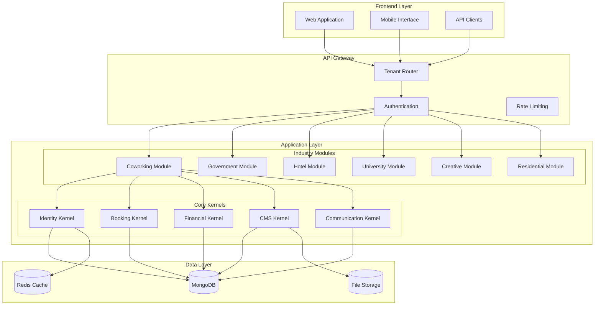
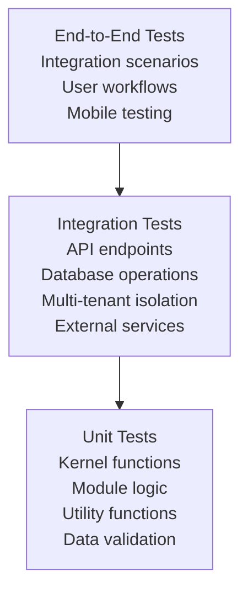

# Design Document: Multi-Tenant Space Management Platform

## Overview

The Multi-Tenant Space Management Platform is a comprehensive SaaS solution that provides space-as-a-service functionality across multiple industries. The platform uses a kernel-module architecture where shared business logic (kernels) provides core functionality while industry-specific modules customize the experience for different sectors including coworking spaces, government facilities, hotels, universities, creative studios, and residential properties.

### Key Design Principles

1. **Multi-Tenant Isolation**: Complete data and configuration isolation between tenants
2. **Industry Modularity**: Pluggable modules that customize terminology, workflows, and features
3. **Kernel-Based Architecture**: Shared business logic across all tenants for consistency and maintainability
4. **API-First Design**: RESTful APIs with comprehensive documentation for integration flexibility
5. **Mobile-First Responsive Design**: Optimized for mobile devices with progressive web app capabilities

## Architecture

### High-Level Architecture



### Multi-Tenant Architecture Design

**Tenant Isolation Strategy**: Database-level isolation using tenant_id filtering with subdomain-based routing.

**Rationale**: This approach provides strong data isolation while maintaining cost efficiency by sharing infrastructure. Each tenant gets a unique subdomain (e.g., `acme-coworking.claude.com`) that routes to their isolated data context.

**Implementation Details**:
- All database documents include a `tenant_id` field
- Middleware automatically injects tenant context into all queries
- Subdomain routing determines tenant context
- Tenant-specific configuration stored in dedicated tenant collection

### Kernel-Module Pattern

**Design Decision**: Separate core business logic (kernels) from industry-specific customizations (modules).

**Rationale**: This separation allows adding new industries without modifying core functionality, reduces code duplication, and ensures consistent behavior across all tenants while enabling industry-specific customization.

**Kernel Responsibilities**:
- Identity: Authentication, authorization, user management
- Booking: Resource scheduling, availability management, conflict resolution
- Financial: Billing, payments, invoicing, subscription management
- CMS: Content management, page building, template system
- Communication: Notifications, workflows, messaging

**Module Responsibilities**:
- Industry-specific terminology mapping
- Custom business rules and constraints
- Specialized UI components and workflows
- Industry-specific integrations

## Components and Interfaces

### Core Kernels

#### Identity Kernel
```python
class IdentityKernel:
    async def authenticate_user(self, credentials: UserCredentials) -> AuthResult
    async def authorize_action(self, user: User, action: str, resource: str) -> bool
    async def create_user(self, user_data: UserCreateData) -> User
    async def manage_roles(self, user_id: str, roles: List[Role]) -> bool
    async def get_user_permissions(self, user_id: str) -> List[Permission]
    async def enable_mfa(self, user_id: str, method: MFAMethod) -> MFAResult
    async def handle_sso(self, sso_data: SSOData) -> AuthResult
```

**Design Rationale**: Centralized identity management ensures consistent security across all modules while supporting industry-specific role hierarchies and enterprise authentication requirements.

#### Booking Kernel
```python
class BookingKernel:
    async def check_availability(self, resource_id: str, time_range: TimeRange) -> AvailabilityResult
    async def create_booking(self, booking_data: BookingCreateData) -> Booking
    async def apply_business_rules(self, booking: Booking, rules: List[BusinessRule]) -> ValidationResult
    async def handle_conflicts(self, booking: Booking) -> ConflictResolution
    async def manage_waitlist(self, resource_id: str, time_range: TimeRange) -> WaitlistEntry
    async def send_booking_notifications(self, booking: Booking) -> NotificationResult
```

**Design Rationale**: Flexible booking engine that can adapt to different industry constraints (hourly vs daily bookings, member priorities, advance booking limits) while maintaining consistent conflict resolution.

#### Financial Kernel
```python
class FinancialKernel:
    async def create_invoice(self, invoice_data: InvoiceData) -> Invoice
    async def process_payment(self, payment_data: PaymentData) -> PaymentResult
    async def manage_subscription(self, subscription_data: SubscriptionData) -> Subscription
    async def generate_reports(self, report_params: ReportParams) -> FinancialReport
    async def handle_dunning(self, account_id: str) -> DunningResult
    async def calculate_pricing(self, booking: Booking, pricing_rules: PricingRules) -> PricingResult
```

#### CMS Kernel
```python
class CMSKernel:
    async def create_page(self, page_data: PageData) -> Page
    async def manage_templates(self, template_data: TemplateData) -> Template
    async def handle_widgets(self, widget_config: WidgetConfig) -> Widget
    async def publish_content(self, content_id: str) -> PublishResult
    async def manage_versions(self, content_id: str) -> List[Version]
    async def optimize_for_mobile(self, page_id: str) -> OptimizationResult
```

#### Communication Kernel
```python
class CommunicationKernel:
    async def send_notification(self, notification_data: NotificationData) -> NotificationResult
    async def create_workflow(self, workflow_config: WorkflowConfig) -> Workflow
    async def manage_templates(self, template_data: MessageTemplate) -> Template
    async def handle_preferences(self, user_id: str, preferences: CommunicationPreferences) -> bool
    async def send_bulk_communication(self, campaign_data: CampaignData) -> CampaignResult
```

### Industry Modules

#### Base Module Interface
```python
class BaseModule:
    def get_terminology(self) -> Dict[str, str]
    def get_business_rules(self) -> List[BusinessRule]
    def get_role_hierarchy(self) -> RoleHierarchy
    def get_custom_fields(self) -> List[CustomField]
    def get_ui_components(self) -> Dict[str, Component]
    def get_workflow_templates(self) -> List[WorkflowTemplate]
    def get_pricing_models(self) -> List[PricingModel]
    def get_compliance_requirements(self) -> ComplianceConfig
```

**Design Rationale**: Standardized interface ensures all modules provide consistent customization points while allowing industry-specific implementations.

### Lead Management System

#### Lead Capture & Processing
```python
class LeadManager:
    async def create_form(self, form_config: FormConfig) -> Form
    async def process_submission(self, form_data: FormSubmission) -> Lead
    async def score_lead(self, lead: Lead, scoring_rules: ScoringRules) -> LeadScore
    async def route_lead(self, lead: Lead, routing_rules: RoutingRules) -> RoutingResult
    async def schedule_tour(self, lead_id: str, tour_data: TourData) -> Tour
```

**Design Decision**: Integrated lead management with booking system for seamless tour scheduling.

**Rationale**: Eliminates data silos and provides unified customer journey from lead capture to booking conversion.

### API Layer Design

**RESTful API Structure**:
```
/api/v1/
├── auth/                    # Authentication endpoints
├── users/                   # User management
├── spaces/                  # Space/resource management
├── bookings/               # Booking operations
├── financial/              # Billing and payments
├── cms/                    # Content management
├── leads/                  # Lead management
├── communications/         # Messaging and notifications
├── reports/               # Analytics and reporting
├── integrations/          # Third-party integrations
└── mobile/                # Mobile-specific endpoints
```

**Design Decision**: Version-prefixed REST APIs with resource-based URLs and dedicated mobile endpoints.

**Rationale**: Provides clear API evolution path, follows REST conventions, enables easy integration, and optimizes mobile performance.

## Data Models

### Core Data Models

#### Tenant Model
```python
class Tenant:
    id: ObjectId
    name: str
    subdomain: str
    industry_module: str
    configuration: Dict[str, Any]
    subscription_plan: str
    created_at: datetime
    updated_at: datetime
    is_active: bool
```

#### User Model
```python
class User:
    id: ObjectId
    tenant_id: ObjectId
    email: str
    password_hash: str
    first_name: str
    last_name: str
    roles: List[str]
    permissions: List[str]
    profile_data: Dict[str, Any]  # Industry-specific fields
    preferences: UserPreferences
    mfa_enabled: bool
    sso_provider: Optional[str]
    created_at: datetime
    last_login: datetime
    is_active: bool
```

#### Space/Resource Model
```python
class Space:
    id: ObjectId
    tenant_id: ObjectId
    name: str
    type: str  # Meeting room, desk, studio, etc.
    capacity: int
    amenities: List[str]
    booking_rules: BookingRules
    pricing: PricingConfig
    location: LocationData
    availability_schedule: Schedule
    images: List[str]
    is_active: bool
```

#### Booking Model
```python
class Booking:
    id: ObjectId
    tenant_id: ObjectId
    user_id: ObjectId
    space_id: ObjectId
    start_time: datetime
    end_time: datetime
    status: BookingStatus
    booking_type: str
    attendees: List[ObjectId]
    special_requests: str
    payment_status: PaymentStatus
    waitlist_position: Optional[int]
    created_at: datetime
```

#### Lead Model
```python
class Lead:
    id: ObjectId
    tenant_id: ObjectId
    first_name: str
    last_name: str
    email: str
    phone: Optional[str]
    company: Optional[str]
    source: str
    status: LeadStatus
    score: int
    form_data: Dict[str, Any]
    assigned_to: Optional[ObjectId]
    tour_scheduled: Optional[datetime]
    notes: List[Note]
    created_at: datetime
    updated_at: datetime
```

#### CMS Page Model
```python
class Page:
    id: ObjectId
    tenant_id: ObjectId
    title: str
    slug: str
    content: List[ContentBlock]
    template_id: ObjectId
    meta_data: PageMetaData
    seo_settings: SEOSettings
    is_published: bool
    version: int
    mobile_optimized: bool
    created_by: ObjectId
    created_at: datetime
    updated_at: datetime
```

### Data Relationships

**Design Decision**: Document-based relationships with embedded data for performance-critical queries and references for normalized data.

**Rationale**: MongoDB's document model allows for flexible schemas while maintaining referential integrity where needed. Embedded data reduces query complexity for read-heavy operations.

## Error Handling

### Error Classification System

```python
class ErrorType(Enum):
    VALIDATION_ERROR = "validation_error"
    AUTHENTICATION_ERROR = "authentication_error"
    AUTHORIZATION_ERROR = "authorization_error"
    RESOURCE_NOT_FOUND = "resource_not_found"
    BUSINESS_RULE_VIOLATION = "business_rule_violation"
    EXTERNAL_SERVICE_ERROR = "external_service_error"
    SYSTEM_ERROR = "system_error"
    TENANT_ISOLATION_ERROR = "tenant_isolation_error"
```

### Error Response Format
```python
class ErrorResponse:
    error_type: ErrorType
    message: str
    details: Dict[str, Any]
    error_code: str
    timestamp: datetime
    request_id: str
    tenant_id: Optional[str]
```

**Design Rationale**: Standardized error handling across all APIs ensures consistent client experience and enables proper error tracking and debugging while maintaining tenant isolation.

### Error Handling Strategy

1. **Validation Errors**: Return 400 with detailed field-level validation messages
2. **Authentication Errors**: Return 401 with clear authentication requirements
3. **Authorization Errors**: Return 403 with minimal information to prevent information disclosure
4. **Business Rule Violations**: Return 422 with business-context error messages
5. **System Errors**: Return 500 with generic message, log detailed information
6. **Tenant Isolation Errors**: Return 403 with generic access denied message

## Testing Strategy

### Testing Pyramid



### Test Categories

#### Unit Tests (70% of test coverage)
- **Kernel Functions**: Test each kernel method in isolation
- **Module Logic**: Test industry-specific customizations and terminology
- **Utility Functions**: Test helper functions and validators
- **Data Models**: Test model validation and serialization
- **Business Rules**: Test industry-specific business logic

#### Integration Tests (20% of test coverage)
- **API Endpoints**: Test complete request/response cycles
- **Database Operations**: Test data persistence and retrieval
- **Multi-tenant Isolation**: Verify tenant data separation and security
- **External Service Integration**: Test third-party API interactions
- **Lead Management Flow**: Test form submission to tour scheduling
- **CMS Functionality**: Test page creation and publishing workflows

#### End-to-End Tests (10% of test coverage)
- **User Workflows**: Test complete user journeys across modules
- **Cross-module Integration**: Test kernel-module interactions
- **Industry-specific Scenarios**: Test module-specific workflows
- **Mobile Responsiveness**: Test mobile-first design implementation
- **Performance Scenarios**: Test under load conditions

### Testing Tools and Framework

**Backend Testing**:
- pytest for test framework
- pytest-asyncio for async test support
- mongomock for database mocking
- httpx for API testing
- factory_boy for test data generation

**Frontend Testing**:
- Jest for unit testing
- React Testing Library for component testing
- Cypress for end-to-end testing
- MSW (Mock Service Worker) for API mocking

### Multi-Tenant Testing Strategy

**Design Decision**: Isolated test environments per tenant with automated tenant data cleanup.

**Rationale**: Ensures tests accurately reflect production multi-tenant behavior while preventing test data contamination between tenants.