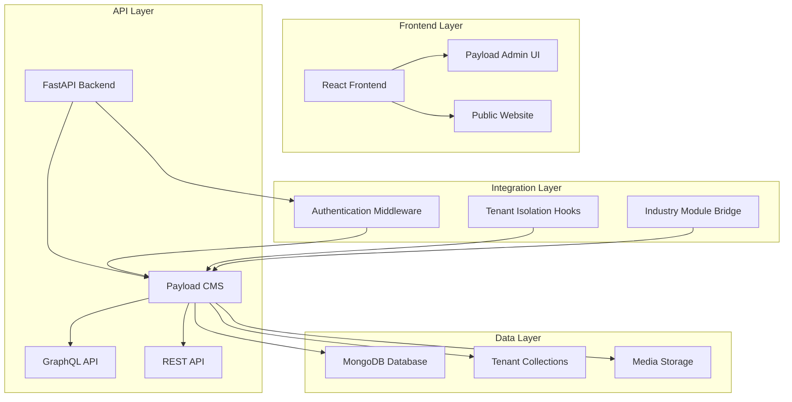

# Design Document

## Overview

The Payload CMS integration will provide a powerful, headless content management system that seamlessly integrates with the existing multi-tenant Claude platform. This integration maintains the platform's core architectural principles while adding professional-grade content management capabilities with industry-specific templates and workflows.

The design leverages Payload CMS's headless architecture to provide both GraphQL and REST APIs for content consumption, while ensuring complete tenant isolation and role-based access control through custom hooks and middleware.

## Architecture

### High-Level Architecture



### Integration Points

1. **Authentication Integration**: Payload CMS will integrate with the existing JWT-based authentication system
2. **Database Integration**: Shared MongoDB instance with tenant-scoped collections
3. **Module Integration**: Industry-specific templates and configurations loaded via module system
4. **API Integration**: Payload APIs consumed by existing React frontend and new admin interface

## Components and Interfaces

### Core Components

#### 1. Payload Configuration (`payload.config.ts`)

```typescript
interface PayloadConfig {
  serverURL: string;
  admin: {
    user: string;
    meta: {
      titleSuffix: string;
    };
  };
  collections: Collection[];
  globals: Global[];
  typescript: {
    outputFile: string;
  };
  graphQL: {
    schemaOutputFile: string;
  };
  db: MongooseAdapter;
  plugins: Plugin[];
}
```

#### 2. Tenant Isolation Middleware

```typescript
interface TenantContext {
  tenantId: string;
  industryModule: string;
  userRole: string;
  permissions: string[];
}

interface TenantHook {
  beforeOperation: (args: BeforeOperationArgs) => Promise<void>;
  afterOperation: (args: AfterOperationArgs) => Promise<void>;
  access: (args: AccessArgs) => Promise<boolean>;
}
```

#### 3. Industry Module Bridge

```typescript
interface ModuleBridge {
  getTemplates(industryModule: string): Promise<Template[]>;
  getFieldConfigurations(industryModule: string): Promise<FieldConfig[]>;
  getWorkflows(industryModule: string): Promise<Workflow[]>;
  translateContent(content: any, industryModule: string): Promise<any>;
}
```

### Collection Definitions

#### 1. Pages Collection

```typescript
interface PageCollection {
  slug: 'pages';
  admin: {
    useAsTitle: 'title';
    defaultColumns: ['title', 'status', 'updatedAt'];
  };
  access: {
    read: TenantAccessControl;
    create: RoleBasedAccess;
    update: RoleBasedAccess;
    delete: RoleBasedAccess;
  };
  hooks: {
    beforeChange: [AddTenantContext, ValidateSlug];
    afterChange: [InvalidateCache, TriggerWebhooks];
  };
  fields: [
    TenantField,
    TitleField,
    SlugField,
    ContentField,
    MetaFields,
    StatusField,
    TemplateField
  ];
}
```

#### 2. Media Collection

```typescript
interface MediaCollection {
  slug: 'media';
  upload: {
    staticURL: '/media';
    staticDir: 'media';
    adminThumbnail: 'thumbnail';
    mimeTypes: ['image/*', 'application/pdf'];
  };
  access: {
    read: TenantMediaAccess;
    create: RoleBasedAccess;
    update: RoleBasedAccess;
    delete: RoleBasedAccess;
  };
  hooks: {
    beforeChange: [AddTenantContext, ValidateFileSize];
    afterDelete: [CleanupFiles];
  };
}
```

#### 3. Templates Collection

```typescript
interface TemplateCollection {
  slug: 'templates';
  admin: {
    useAsTitle: 'name';
  };
  access: {
    read: PublicAccess;
    create: AdminAccess;
    update: AdminAccess;
    delete: AdminAccess;
  };
  fields: [
    NameField,
    IndustryModuleField,
    PreviewImageField,
    LayoutConfigField,
    DefaultContentField
  ];
}
```

### API Interfaces

#### 1. GraphQL Schema Extensions

```graphql
type Page {
  id: ID!
  tenantId: String!
  title: String!
  slug: String!
  content: JSON
  metaTitle: String
  metaDescription: String
  status: PageStatus!
  template: Template
  isHomepage: Boolean!
  createdAt: DateTime!
  updatedAt: DateTime!
}

type Template {
  id: ID!
  name: String!
  industryModule: IndustryModule!
  previewImage: Media
  layoutConfig: JSON!
  defaultContent: JSON!
}

enum PageStatus {
  DRAFT
  PUBLISHED
  ARCHIVED
}

enum IndustryModule {
  COWORKING
  GOVERNMENT
  HOTEL
  UNIVERSITY
  CREATIVE
  RESIDENTIAL
}
```

#### 2. REST API Extensions

```typescript
interface PayloadRESTAPI {
  // Pages
  'GET /api/pages': {
    query: PaginationQuery & TenantQuery;
    response: PaginatedResponse<Page>;
  };
  
  'POST /api/pages': {
    body: CreatePageRequest;
    response: Page;
  };
  
  'PUT /api/pages/:id': {
    params: { id: string };
    body: UpdatePageRequest;
    response: Page;
  };
  
  // Media
  'POST /api/media': {
    body: FormData;
    response: Media;
  };
  
  // Templates
  'GET /api/templates': {
    query: { industryModule?: string };
    response: Template[];
  };
}
```

## Data Models

### Enhanced Data Models

#### 1. Page Model Extensions

```typescript
interface PayloadPage extends BasePage {
  tenantId: string;
  industryModule: string;
  template?: {
    id: string;
    name: string;
    layoutConfig: any;
  };
  seoFields: {
    metaTitle?: string;
    metaDescription?: string;
    openGraphImage?: Media;
    canonicalURL?: string;
  };
  publishingOptions: {
    publishedAt?: Date;
    scheduledFor?: Date;
    expiresAt?: Date;
  };
  contentBlocks: ContentBlock[];
  revisions: PageRevision[];
}
```

#### 2. Content Block Model

```typescript
interface ContentBlock {
  id: string;
  type: string;
  config: Record<string, any>;
  order: number;
  visibility: {
    roles?: string[];
    features?: string[];
    dateRange?: {
      start?: Date;
      end?: Date;
    };
  };
}
```

#### 3. Media Model Extensions

```typescript
interface PayloadMedia extends BaseMedia {
  tenantId: string;
  folder?: string;
  tags: string[];
  altText?: string;
  caption?: string;
  usage: MediaUsage[];
  metadata: {
    dimensions?: { width: number; height: number };
    fileSize: number;
    mimeType: string;
    uploadedBy: string;
  };
}
```

### Database Schema

#### MongoDB Collections Structure

```javascript
// pages collection
{
  _id: ObjectId,
  id: String, // UUID for API consistency
  tenantId: String, // Tenant isolation
  title: String,
  slug: String,
  content: Object, // Rich content blocks
  metaTitle: String,
  metaDescription: String,
  status: String, // draft, published, archived
  templateId: String,
  isHomepage: Boolean,
  industryModule: String,
  publishedAt: Date,
  createdAt: Date,
  updatedAt: Date,
  createdBy: String,
  updatedBy: String
}

// media collection
{
  _id: ObjectId,
  id: String,
  tenantId: String,
  filename: String,
  mimeType: String,
  filesize: Number,
  width: Number,
  height: Number,
  alt: String,
  url: String,
  folder: String,
  tags: [String],
  createdAt: Date,
  uploadedBy: String
}

// templates collection
{
  _id: ObjectId,
  id: String,
  name: String,
  industryModule: String,
  previewImage: String,
  layoutConfig: Object,
  defaultContent: Object,
  isActive: Boolean,
  createdAt: Date
}
```

## Error Handling

### Error Types and Handling Strategy

#### 1. Authentication Errors

```typescript
class PayloadAuthError extends Error {
  constructor(message: string, public statusCode: number = 401) {
    super(message);
    this.name = 'PayloadAuthError';
  }
}

// Handler
const handleAuthError = (error: PayloadAuthError) => {
  return {
    errors: [{
      message: error.message,
      extensions: {
        code: 'UNAUTHENTICATED',
        statusCode: error.statusCode
      }
    }]
  };
};
```

#### 2. Tenant Isolation Errors

```typescript
class TenantAccessError extends Error {
  constructor(tenantId: string, resource: string) {
    super(`Access denied to ${resource} for tenant ${tenantId}`);
    this.name = 'TenantAccessError';
  }
}
```

#### 3. Validation Errors

```typescript
interface ValidationError {
  field: string;
  message: string;
  value: any;
}

class PayloadValidationError extends Error {
  constructor(public errors: ValidationError[]) {
    super('Validation failed');
    this.name = 'PayloadValidationError';
  }
}
```

### Error Recovery Mechanisms

1. **Graceful Degradation**: If Payload CMS is unavailable, fall back to basic page serving
2. **Retry Logic**: Implement exponential backoff for transient failures
3. **Circuit Breaker**: Prevent cascade failures when CMS is down
4. **Audit Logging**: Log all errors with tenant context for debugging

## Testing Strategy

### Testing Levels

#### 1. Unit Tests

```typescript
describe('Tenant Isolation Hooks', () => {
  test('should filter content by tenant ID', async () => {
    const hook = new TenantIsolationHook();
    const result = await hook.beforeOperation({
      operation: 'read',
      args: { where: {} },
      req: { user: { tenantId: 'tenant-1' } }
    });
    
    expect(result.args.where.tenantId).toBe('tenant-1');
  });
});
```

#### 2. Integration Tests

```typescript
describe('Payload CMS Integration', () => {
  test('should create page with tenant context', async () => {
    const response = await request(app)
      .post('/api/pages')
      .set('Authorization', `Bearer ${tenantToken}`)
      .send({
        title: 'Test Page',
        slug: 'test-page',
        content: []
      });
    
    expect(response.status).toBe(201);
    expect(response.body.tenantId).toBe('test-tenant');
  });
});
```

#### 3. End-to-End Tests

```typescript
describe('CMS Workflow', () => {
  test('should complete full content creation workflow', async () => {
    // Login as content creator
    await page.goto('/admin/login');
    await page.fill('[name="email"]', 'creator@test.com');
    await page.fill('[name="password"]', 'password');
    await page.click('button[type="submit"]');
    
    // Create new page
    await page.goto('/admin/collections/pages');
    await page.click('text=Create New');
    await page.fill('[name="title"]', 'Test Page');
    await page.fill('[name="slug"]', 'test-page');
    
    // Add content blocks
    await page.click('text=Add Block');
    await page.selectOption('[name="blockType"]', 'hero_banner');
    
    // Publish page
    await page.selectOption('[name="status"]', 'published');
    await page.click('button:has-text("Save")');
    
    // Verify page is accessible
    await page.goto('/test-page');
    expect(await page.textContent('h1')).toBe('Test Page');
  });
});
```

### Performance Testing

#### 1. Load Testing

```typescript
describe('CMS Performance', () => {
  test('should handle concurrent content requests', async () => {
    const promises = Array.from({ length: 100 }, () =>
      request(app).get('/api/pages').expect(200)
    );
    
    const results = await Promise.all(promises);
    expect(results.every(r => r.status === 200)).toBe(true);
  });
});
```

#### 2. Database Performance

```typescript
describe('Database Queries', () => {
  test('should use efficient indexes for tenant queries', async () => {
    const explain = await db.collection('pages')
      .find({ tenantId: 'test-tenant' })
      .explain('executionStats');
    
    expect(explain.executionStats.executionTimeMillis).toBeLessThan(100);
    expect(explain.executionStats.indexesUsed).toContain('tenantId_1');
  });
});
```

## Security Considerations

### Authentication and Authorization

1. **JWT Integration**: Seamless integration with existing authentication system
2. **Role-Based Access**: Granular permissions based on user roles and tenant context
3. **API Security**: Rate limiting, input validation, and CORS configuration
4. **Session Management**: Secure session handling with appropriate timeouts

### Data Protection

1. **Encryption**: Data encrypted at rest and in transit
2. **Input Sanitization**: All user inputs sanitized to prevent XSS and injection attacks
3. **File Upload Security**: Virus scanning and file type validation for media uploads
4. **Audit Trails**: Comprehensive logging of all content operations

### Compliance

1. **GDPR Compliance**: Data portability, right to be forgotten, consent management
2. **Accessibility**: WCAG 2.1 AA compliance for admin interface
3. **Data Retention**: Configurable retention policies for content and media

## Performance Optimization

### Caching Strategy

1. **Content Caching**: Redis-based caching for published content
2. **Media CDN**: CloudFront integration for media delivery
3. **GraphQL Caching**: Query result caching with invalidation
4. **Database Optimization**: Proper indexing and query optimization

### Scalability

1. **Horizontal Scaling**: Support for multiple Payload instances
2. **Database Sharding**: Tenant-based sharding strategy
3. **Media Storage**: Scalable cloud storage with CDN integration
4. **Load Balancing**: Proper load distribution across instances