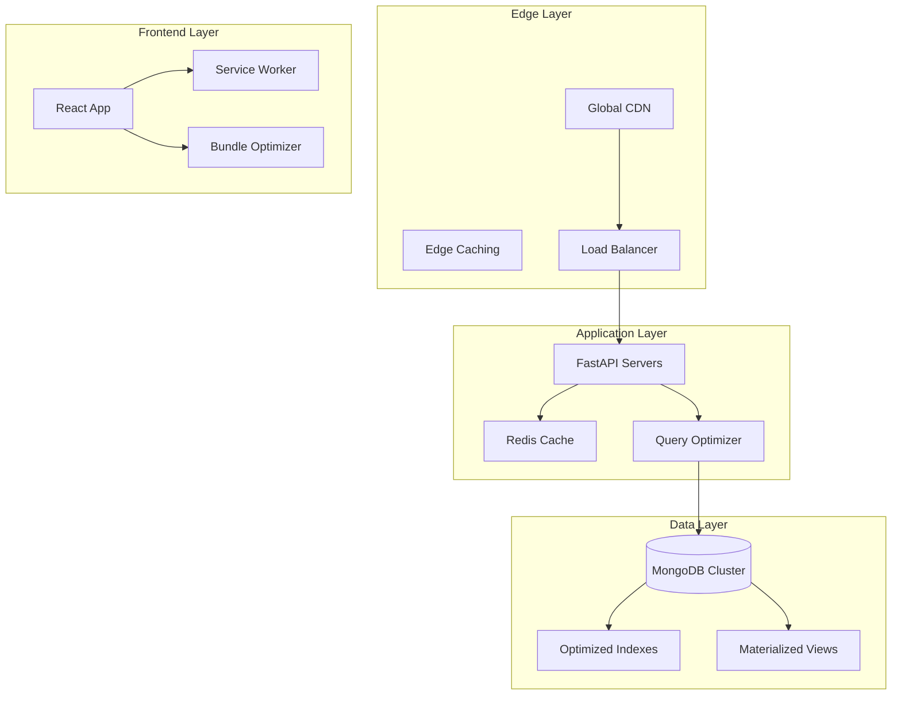
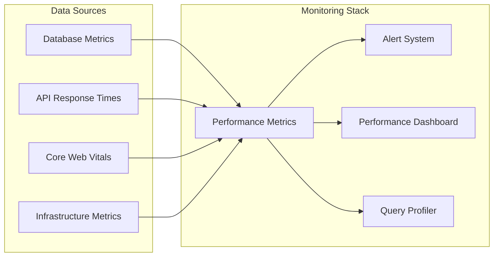

# Performance Optimization Design Document

## Overview

This design document outlines a comprehensive performance optimization strategy for the Claude platform, addressing database performance, frontend responsiveness, caching strategies, and scalability requirements. The solution leverages modern performance techniques including database indexing, query optimization, CDN integration, intelligent caching, and auto-scaling infrastructure.

## Architecture

### High-Level Performance Architecture



### Performance Monitoring Architecture



## Components and Interfaces

### 1. Database Performance Layer

#### Query Optimization Service
```python
class QueryOptimizer:
    def __init__(self, db: AsyncIOMotorDatabase):
        self.db = db
        self.query_cache = {}
        self.slow_query_threshold = 100  # ms
    
    async def execute_optimized_query(self, collection: str, query: dict, options: dict = None):
        # Query optimization logic with caching and monitoring
        pass
    
    async def create_tenant_indexes(self, tenant_id: str):
        # Create tenant-specific indexes for optimal performance
        pass
    
    async def monitor_slow_queries(self):
        # Monitor and alert on slow queries
        pass
```

#### Database Index Manager
```python
class IndexManager:
    def __init__(self, db: AsyncIOMotorDatabase):
        self.db = db
    
    async def create_performance_indexes(self):
        # Create compound indexes for common query patterns
        pass
    
    async def create_tenant_isolation_indexes(self):
        # Ensure tenant_id is indexed on all collections
        pass
    
    async def create_materialized_views(self):
        # Create aggregation pipeline views for complex reporting
        pass
```

### 2. Frontend Performance Layer

#### Bundle Optimization Service
```javascript
class BundleOptimizer {
    constructor() {
        this.chunkStrategy = 'dynamic';
        this.compressionEnabled = true;
    }
    
    optimizeBundle() {
        // Code splitting and lazy loading configuration
    }
    
    enableServiceWorker() {
        // Service worker for caching and offline support
    }
    
    optimizeAssets() {
        // Image optimization and asset compression
    }
}
```

#### Performance Monitor
```javascript
class PerformanceMonitor {
    constructor() {
        this.vitalsThresholds = {
            LCP: 2500,  // Largest Contentful Paint
            FID: 100,   // First Input Delay
            CLS: 0.1    // Cumulative Layout Shift
        };
    }
    
    measureCoreWebVitals() {
        // Measure and report Core Web Vitals
    }
    
    trackPageLoadTimes() {
        // Track page load performance
    }
    
    reportPerformanceMetrics() {
        // Send metrics to monitoring service
    }
}
```

### 3. Caching Layer

#### Multi-Level Cache Strategy
```python
class CacheManager:
    def __init__(self, redis_client, cdn_client):
        self.redis = redis_client
        self.cdn = cdn_client
        self.cache_strategies = {
            'static_assets': {'ttl': 86400, 'level': 'cdn'},
            'api_responses': {'ttl': 300, 'level': 'redis'},
            'user_sessions': {'ttl': 1800, 'level': 'redis'},
            'tenant_data': {'ttl': 600, 'level': 'redis'}
        }
    
    async def get_cached_data(self, key: str, cache_type: str):
        # Retrieve data from appropriate cache level
        pass
    
    async def set_cached_data(self, key: str, data: any, cache_type: str):
        # Store data in appropriate cache level
        pass
    
    async def invalidate_cache(self, pattern: str):
        # Intelligent cache invalidation
        pass
```

### 4. Auto-Scaling Infrastructure

#### Load Management Service
```python
class LoadManager:
    def __init__(self):
        self.scaling_thresholds = {
            'cpu_threshold': 70,
            'memory_threshold': 80,
            'concurrent_users_threshold': 1000,
            'response_time_threshold': 500
        }
    
    async def monitor_system_load(self):
        # Monitor system metrics and trigger scaling
        pass
    
    async def scale_horizontally(self, target_instances: int):
        # Horizontal scaling logic
        pass
    
    async def prioritize_critical_operations(self):
        # Resource prioritization during high load
        pass
```

## Data Models

### Performance Metrics Model
```python
class PerformanceMetric(BaseModel):
    id: str = Field(default_factory=lambda: str(uuid.uuid4()))
    tenant_id: str
    metric_type: str  # 'database', 'api', 'frontend', 'infrastructure'
    metric_name: str
    value: float
    threshold: Optional[float]
    timestamp: datetime
    metadata: Dict[str, Any] = {}
```

### Query Performance Model
```python
class QueryPerformance(BaseModel):
    id: str = Field(default_factory=lambda: str(uuid.uuid4()))
    tenant_id: str
    collection: str
    query_hash: str
    execution_time_ms: float
    index_used: Optional[str]
    documents_examined: int
    documents_returned: int
    timestamp: datetime
    is_slow_query: bool = False
```

### Cache Configuration Model
```python
class CacheConfig(BaseModel):
    id: str = Field(default_factory=lambda: str(uuid.uuid4()))
    tenant_id: str
    cache_type: str
    cache_key_pattern: str
    ttl_seconds: int
    invalidation_strategy: str
    hit_rate_threshold: float = 0.8
    created_at: datetime
    updated_at: datetime
```

## Error Handling

### Performance Degradation Handling
```python
class PerformanceDegradationHandler:
    def __init__(self):
        self.fallback_strategies = {
            'database_slow': self.enable_aggressive_caching,
            'high_load': self.enable_graceful_degradation,
            'cache_miss': self.fallback_to_origin,
            'cdn_failure': self.direct_origin_serving
        }
    
    async def handle_performance_issue(self, issue_type: str, context: dict):
        # Handle performance degradation with appropriate fallback
        pass
    
    async def enable_graceful_degradation(self, context: dict):
        # Disable non-critical features during high load
        pass
    
    async def enable_aggressive_caching(self, context: dict):
        # Increase cache TTL and enable more aggressive caching
        pass
```

### Circuit Breaker Pattern
```python
class CircuitBreaker:
    def __init__(self, failure_threshold: int = 5, timeout: int = 60):
        self.failure_threshold = failure_threshold
        self.timeout = timeout
        self.failure_count = 0
        self.last_failure_time = None
        self.state = 'CLOSED'  # CLOSED, OPEN, HALF_OPEN
    
    async def call(self, func, *args, **kwargs):
        # Circuit breaker logic for external service calls
        pass
```

## Testing Strategy

### Performance Testing Framework
```python
class PerformanceTestSuite:
    def __init__(self):
        self.load_test_scenarios = [
            'normal_load',
            'peak_load',
            'stress_test',
            'spike_test',
            'volume_test'
        ]
    
    async def run_database_performance_tests(self):
        # Test database query performance under various loads
        pass
    
    async def run_frontend_performance_tests(self):
        # Test Core Web Vitals and page load times
        pass
    
    async def run_caching_performance_tests(self):
        # Test cache hit rates and invalidation strategies
        pass
    
    async def run_scalability_tests(self):
        # Test auto-scaling behavior under load
        pass
```

### Continuous Performance Monitoring
```python
class ContinuousPerformanceMonitor:
    def __init__(self):
        self.monitoring_intervals = {
            'database_metrics': 30,  # seconds
            'api_metrics': 10,
            'frontend_metrics': 60,
            'infrastructure_metrics': 30
        }
    
    async def collect_performance_metrics(self):
        # Continuously collect performance metrics
        pass
    
    async def analyze_performance_trends(self):
        # Analyze performance trends and predict issues
        pass
    
    async def generate_performance_reports(self):
        # Generate automated performance reports
        pass
```

## Implementation Considerations

### Database Optimization Strategy
- **Compound Indexes**: Create indexes that support multiple query patterns
- **Tenant Isolation**: Ensure all queries are properly filtered by tenant_id
- **Query Optimization**: Implement query result caching and connection pooling
- **Materialized Views**: Pre-compute complex aggregations for reporting

### Frontend Optimization Strategy
- **Code Splitting**: Implement route-based and component-based code splitting
- **Asset Optimization**: Compress images, minify CSS/JS, enable gzip compression
- **Service Worker**: Implement intelligent caching and offline support
- **Bundle Analysis**: Regular bundle size analysis and optimization

### Caching Strategy
- **Multi-Level Caching**: CDN for static assets, Redis for dynamic data
- **Cache Invalidation**: Smart invalidation based on data dependencies
- **Cache Warming**: Pre-populate cache with frequently accessed data
- **Cache Monitoring**: Track hit rates and optimize cache strategies

### Scalability Strategy
- **Horizontal Scaling**: Auto-scaling based on load metrics
- **Database Sharding**: Implement tenant-based sharding for large datasets
- **Load Balancing**: Intelligent load distribution across instances
- **Resource Prioritization**: Ensure critical operations get priority during high load

This design provides a comprehensive foundation for implementing high-performance, scalable infrastructure that meets all the specified performance requirements while maintaining system reliability and user experience quality.