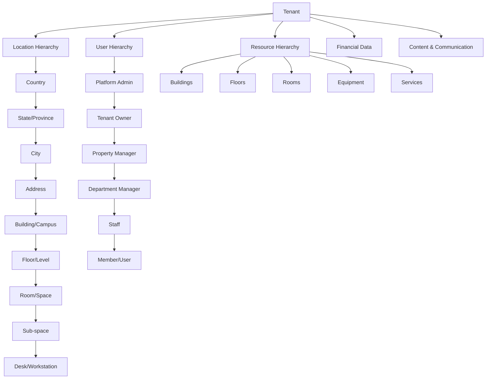
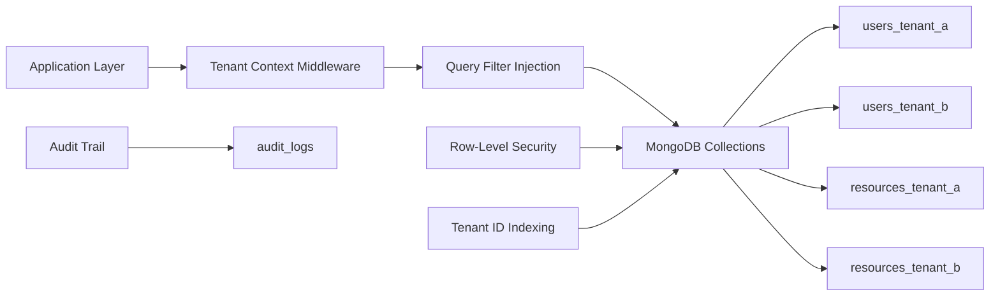
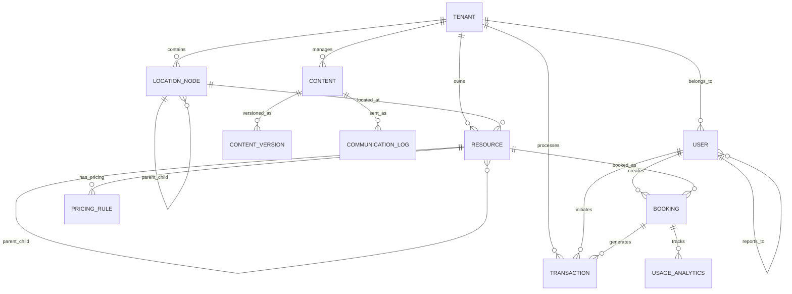

# Universal Data Architecture Design

## Overview

The Universal Data Architecture provides a comprehensive, hierarchical data structure that supports unlimited industry configurations and use cases. This design establishes the foundational data layer that enables the Claude platform to handle any type of space configuration from simple rooms to complex multi-building campuses across all supported industries.

The architecture is built on five core principles:
1. **Hierarchical Flexibility** - Unlimited nesting levels with flexible relationships
2. **Multi-Tenant Isolation** - Complete data separation with performance optimization
3. **Industry Adaptability** - Dynamic schema and terminology customization
4. **Scalable Performance** - Efficient querying and indexing strategies
5. **Data Integrity** - Comprehensive validation and consistency enforcement

## Architecture

### Core Data Model Hierarchy



### Multi-Tenant Data Isolation Strategy



## Components and Interfaces

### 1. Location Hierarchy System

**LocationNode Interface**
```python
class LocationNode:
    id: str
    tenant_id: str
    parent_id: Optional[str]
    hierarchy_level: int
    hierarchy_path: str  # "/country/state/city/address/building"
    node_type: LocationType  # country, state, city, address, building, floor, room, subspace, desk
    custom_type_name: Optional[str]  # Industry-specific naming
    name: str
    display_name: str
    metadata: Dict[str, Any]
    coordinates: Optional[GeoCoordinates]
    is_active: bool
    created_at: datetime
    updated_at: datetime
```

**Key Features:**
- Unlimited hierarchy depth with flexible parent-child relationships
- Industry-specific type naming (Building/Wing/Campus, Floor/Level, etc.)
- Geospatial support for location-based queries
- Materialized path pattern for efficient tree queries
- Flexible metadata for industry-specific attributes

### 2. Multi-Tenant Data Layer

**TenantContext Service**
```python
class TenantContextService:
    async def get_tenant_context(self, request) -> TenantContext
    async def inject_tenant_filter(self, query: Dict) -> Dict
    async def validate_cross_tenant_access(self, tenant_id: str, resource_id: str) -> bool
    async def cascade_tenant_deletion(self, tenant_id: str) -> AuditResult
```

**Data Isolation Mechanisms:**
- Automatic tenant_id injection in all queries
- MongoDB compound indexes: `{tenant_id: 1, ...other_fields}`
- Row-level security validation
- Cross-tenant reference prevention
- Tenant-specific data export/import capabilities

### 3. Hierarchical User Management

**UserHierarchy System**
```python
class UserHierarchy:
    id: str
    tenant_id: str
    user_id: str
    role: str
    role_display_name: str  # Industry-specific terminology
    parent_user_id: Optional[str]
    department_id: Optional[str]
    company_id: Optional[str]
    permissions: List[Permission]
    inherited_permissions: List[Permission]
    effective_permissions: List[Permission]  # Computed field
    hierarchy_path: str
    is_active: bool
```

**Permission System:**
- Granular permissions at resource and feature levels
- Role inheritance with override capabilities
- Industry-specific role terminology
- Real-time permission updates across platform
- Corporate structure support (Company → Teams → Users)

### 4. Flexible Resource System

**Resource Definition**
```python
class Resource:
    id: str
    tenant_id: str
    location_id: Optional[str]  # Links to LocationNode
    parent_resource_id: Optional[str]
    resource_type: ResourceType
    custom_type_name: Optional[str]
    name: str
    display_name: str
    capacity: Optional[int]
    attributes: Dict[str, Any]  # Industry-specific fields
    pricing_rules: List[PricingRule]
    availability_rules: List[AvailabilityRule]
    booking_constraints: BookingConstraints
    is_bookable: bool
    is_active: bool
    metadata: Dict[str, Any]
```

**Booking System**
```python
class Booking:
    id: str
    tenant_id: str
    resource_id: str
    user_id: str
    start_time: datetime
    end_time: datetime
    recurrence_rule: Optional[RecurrenceRule]
    status: BookingStatus
    attendees: List[Attendee]
    pricing_breakdown: PricingBreakdown
    conflict_resolution: Optional[ConflictResolution]
    usage_analytics: UsageMetrics
    metadata: Dict[str, Any]
```

### 5. Industry Customization Engine

**Schema Evolution System**
```python
class SchemaCustomization:
    tenant_id: str
    industry_module: str
    custom_fields: Dict[str, FieldDefinition]
    terminology_overrides: Dict[str, str]
    validation_rules: List[ValidationRule]
    compliance_requirements: List[ComplianceRule]
    schema_version: str
    migration_history: List[SchemaMigration]
```

**Dynamic Field System:**
- Runtime field addition without schema migration
- Industry-specific validation rules
- Compliance requirement enforcement
- Terminology translation layer
- Schema versioning and rollback capabilities

### 6. Financial Data Architecture

**Transaction System**
```python
class Transaction:
    id: str
    tenant_id: str
    transaction_type: TransactionType
    amount: Decimal
    currency: str
    payment_method: PaymentMethod
    parties: List[TransactionParty]  # Multi-party support
    booking_id: Optional[str]
    subscription_id: Optional[str]
    status: TransactionStatus
    processing_details: ProcessingDetails
    audit_trail: List[AuditEntry]
    created_at: datetime
```

**Revenue Recognition**
```python
class RevenueRecognition:
    id: str
    tenant_id: str
    transaction_id: str
    business_model: BusinessModel
    recognition_schedule: List[RecognitionEntry]
    deferred_revenue: Decimal
    recognized_revenue: Decimal
    adjustments: List[RevenueAdjustment]
```

### 7. Communication & Content System

**Content Management**
```python
class Content:
    id: str
    tenant_id: str
    content_type: ContentType
    title: str
    body: str
    language: str
    version: int
    version_history: List[ContentVersion]
    scheduling: ContentScheduling
    personalization_rules: List[PersonalizationRule]
    metadata: Dict[str, Any]
```

**Communication Tracking**
```python
class CommunicationLog:
    id: str
    tenant_id: str
    user_id: str
    channel: CommunicationChannel  # email, sms, in_app, call
    direction: Direction  # inbound, outbound
    content_id: Optional[str]
    message_content: str
    delivery_status: DeliveryStatus
    engagement_metrics: EngagementMetrics
    workflow_context: Optional[WorkflowContext]
    created_at: datetime
```

## Data Models

### Core Entity Relationships



### MongoDB Collection Design

**Indexing Strategy:**
```javascript
// Primary tenant isolation indexes
db.users.createIndex({tenant_id: 1, email: 1}, {unique: true})
db.resources.createIndex({tenant_id: 1, location_id: 1})
db.bookings.createIndex({tenant_id: 1, resource_id: 1, start_time: 1})
db.transactions.createIndex({tenant_id: 1, created_at: -1})

// Hierarchy optimization indexes
db.location_nodes.createIndex({tenant_id: 1, hierarchy_path: 1})
db.location_nodes.createIndex({tenant_id: 1, parent_id: 1})
db.users.createIndex({tenant_id: 1, hierarchy_path: 1})
db.resources.createIndex({tenant_id: 1, parent_resource_id: 1})

// Performance optimization indexes
db.bookings.createIndex({tenant_id: 1, user_id: 1, start_time: -1})
db.bookings.createIndex({tenant_id: 1, status: 1, start_time: 1})
db.content.createIndex({tenant_id: 1, content_type: 1, language: 1})
```

**Sharding Strategy:**
- Shard key: `{tenant_id: 1, _id: 1}` for optimal tenant isolation
- Chunk size optimization for tenant data distribution
- Zone sharding for geographic data locality

## Error Handling

### Data Integrity Validation

**Hierarchy Validation:**
- Prevent circular references in parent-child relationships
- Validate hierarchy depth limits per tenant configuration
- Ensure location hierarchy consistency
- Validate user role hierarchy constraints

**Cross-Tenant Protection:**
- Automatic tenant_id validation on all operations
- Foreign key constraint enforcement within tenant boundaries
- Audit logging for cross-tenant access attempts
- Data leak prevention mechanisms

**Transaction Integrity:**
- ACID compliance for financial transactions
- Rollback mechanisms for failed multi-step operations
- Idempotency keys for payment processing
- Conflict resolution for concurrent bookings

### Error Recovery Strategies

**Data Corruption Recovery:**
- Automated data consistency checks
- Hierarchy repair utilities
- Orphaned record cleanup
- Backup and restore procedures

**Performance Degradation Handling:**
- Query timeout management
- Index optimization recommendations
- Tenant data archival strategies
- Load balancing for high-traffic tenants

## Testing Strategy

### Unit Testing
- Data model validation testing
- Hierarchy operation testing
- Multi-tenant isolation verification
- Industry customization testing
- Financial calculation accuracy testing

### Integration Testing
- Cross-kernel data consistency testing
- Module integration with data layer
- API endpoint tenant isolation testing
- Database performance testing
- Migration and schema evolution testing

### Performance Testing
- Large hierarchy query performance
- Multi-tenant concurrent access testing
- Financial transaction throughput testing
- Content delivery performance testing
- Search and analytics query optimization

### Security Testing
- Tenant data isolation verification
- Permission system penetration testing
- Data encryption validation
- Audit trail completeness testing
- GDPR compliance testing (right to be forgotten)

### Industry-Specific Testing
- Coworking space workflow testing
- Government facility compliance testing
- Hotel guest management testing
- University academic calendar testing
- Creative studio project management testing